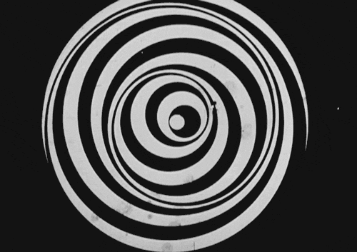
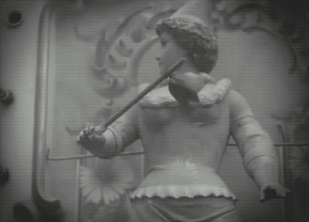

# Narrative Potentials of the Loop

## Abstract

_In digital representations of time and space, every point is virtually next to any other point. While a digital loop may certainly have a beginning and an end, the end of the loop is as close to the beginning as any other point in the timeline. There is no rewind required. A loop is an abstraction that blurs the sense of linear time. A loop that calls attention to itself, that is in the foreground of a user&#39;s experience, puts a frame around temporal sequence, holds it up for inspection rather than narrative immersion. What insights about thought, experience, time and event does the digital loop offer as an expressive element? Drawing on examples of loops in electronic literature past and present, this paper will explore how loops of digital media, along with scripted loops, offers new ways of describing contemporary networked experience._

## Introduction

The gif animation, the looped 6-second video and the &quot;cinemagraph&quot; are popular digital image forms that present primarily non-narrative temporal effects.  Loops are mesmerizing because they contain something uncanny - an experience of timelessness that is made of time. Loops are temporal abstractions rather than temporal representations. With its roots in early animation and film technology, contemporary digital media loops also contain qualities unique to the digital and computation. A digital media loop isan algorithmically generated, perceptible cycle of semiotic content. The computational loop, a central principle in programming, can be applied to any scripted event, text display, animation, audio or video, of any length and in any combination with other loops.  The single digital loop may certainly depict an action with a beginning, middle and end, but it is the recursion (the effortless return from the end back to the beginning of hierarchical stack) that introduces a perceptual novelty not available to unaided human perception.  In animated films, video games, and digital narratives, scripted visual loops are cost effective methods for creating the illusion of continuous flow, usually in the background of some foregrounded sequential narrative development; the animations of swaying trees and rippling water embedded in landscapes, for example.  The same can be said for audio loops that provide a background rhythm track for other more varied musical developments. However, a loop that calls attention to itself, that is in the foreground of a reader or viewer&#39;s experience, puts a frame around a temporal sequence, holds it up for inspection and reflection rather than narrative immersion. Loops, in their cyclical and rhythmic presence, are perhaps more familiar as representations of the workings of thought and memory than any physical phenomena.

Marcel Duchamp |  1923
------------- | -------------
 | 

In avant-garde films of the 1920&#39;s, repetitions and looped sequences were employed to deliberately work against narrative development for either poetic or purely optical effects.  Jean Epstein, a cinema artist and theorist from this period, had a great interest in the range of temporal effects available for narrative cinema. He argued that cinema is not just an mechanical extension of vision, in the way the telescope and microscope are extensions of the eyes&#39; range of perception, but that techniques such as reverse motion, slow motion, fast motion, rapid montage and repetition are non-human additions to perception and thought. Cinema&#39;s catalog of temporal effects are machine abstractions that can depict subjective states, especially if used within narrative structures. Epstein was interested in how these novel temporal effects could translate for the viewer as states of consciousness:

>this machine that stretches or condenses duration, demonstrating that variable nature of time, preaching the relativity of all measures, appears to be endowed with a psyche… the machine is a concrete tool buts its workings provide such a sophisticated semblance of the human mind…(pg 18)

Jean Epstein  | Cœur fidèle, 1923
------------- | -------------
 | 
 | 
 | 

 In his well-know amusement park scene from _Cœur fidèle_, Epstein creates a dizzying sequence of shots made of looped movements – not only the mechanical loop of the carousel, but the flutter of tree branches, clothing and papers streamers. These &quot;nested loops&quot; mirror the narrative of a woman trapped in her own patterns of destructive repetition.  While this uniquely cinematic attention to the repetitions of movement in the physical world is far from the exact repetitions in contemporary digital loops, we can ask a similar question that Epstein asked about the new temporalities of his medium: what are the narrative potentials of the loop in digital fiction?

One of Katherine Hayles&#39; four characteristics of electronic literature is a _fractured temporality._  The spatial navigation ofhypertext fictionmayinvolve repetitions in the traversal of lexia.  The processual engagement of cybertexts may involve repetitions in the selection of media.  If beginnings and endings becomelost to the cyclical and repetitious, what kind of experience might the computational loophelp to narrate?  Lev Manovich, in his 2002_The Language of New Media_, speculated about the digital loop&#39;s future as a narrative element. Instead of treating loops as a &quot;temporary technological limitation&quot;, Manovich wonders if loops are a narrative engine for &quot;a new temporality.&quot;(315)  Starting in the late 90s, the gif animation became a ubiquitous cultural form in works of &quot;new media.&quot; Animated loops were on webpages, works of net art, hypertext, CD-roms, video games and DVD menus. Loops were simple and efficient ways to add motion to static pages of text. The narrative uses of the loop matured with interactive Flash sites. From graphic animations to video loops, Flash fulfilled, for a time, the promise of a truly &quot;interactive cinema.&quot; With improvements in connection speeds, the video loops in Flash sites became longer and more immersive sequences. In the same way that sound altered the evolution of silent cinema art, high-speed connections and better video compression altered the developments of an &quot;interactive cinema&quot; made of video loops, text and sound in favor of the more immersiveand less fragmentary high-definition video of the YouTube age. Video games continue to use computational loops in interesting ways, but they are primarily hidden effects for more &quot;movie-like&quot; narrative immersion. With social media platforms, such as Snapchat, Instagram and the now defunct Vine, the loop returns as a popular and highly expressive form of entertainment, commentary and satire, but mostly within non-narrative contexts. The following are observations about how loops and looping have been used as narrative elements and how they might be integrated into a computational and multimodal writing practice.

## Variable Cycles and Iteration

In his 1972 study of repetition in literature and film, _Telling It Again and Again,_ Bruce F. Kawinmakes a clear distinction between the idea of exact repetition of the same and the &quot;near-repetition&quot; within any time-based presentation. Repetition of the same content, (Gertrud&#39;s Stein&#39;s &quot;a rose is a rose is a rose….&quot;), is an accumulation and therefore a continuous change like the filling up of a cup.

>…any repetition taking place in advancing time is undiscussable. The growth of the work, even from one identical line to another, makes exact repetition impossible… Repetition is a nonverbal state; it cannot be committed to any art that occurs in time.&quot;  (pg 7)_

Kawin&#39;s observation about near-repetition does also apply to digital loops from perspective of a viewer or reader, but in the materiality of computer code, digital looping enacts the same code and is not an accumulation.  This is perhaps what is so uncanny about computational repetition. A digital media loop feels like exact repetition because we know it could go on forever, while a looping action in a film, we sense, will have a limited set of cycles.

Along with the fiction of Calvino and Borges, Beckett&#39;s late works have been an important resource for the practice of computational literature, because of their extreme aesthetics of repetition and iteration. Beckett&#39;s short 1980 &quot;television play,&quot; _Quad,_  stages algorithms of exact repetition performed by four hooded monk-like figures around a square stage. The figures have their heads bowed down and seem oblivious to their &quot;brothers&quot; in different colored robes, and yet each follows the exact same algorithm. However, these strict movements, made either out of habit or as directed by an unknown authority, must be slightly different. There is the perceived differences between the performers, between their own solitary iterations and for the viewer&#39;s evolving attention to the variable patterns. The fascination, and even humor, for the viewer is the expectation of a collision or mishap. It is the accumulation of patterned repetitions, a variable looping, that holds interest in a performance nearly devoid of narrative. And yet, the viewer&#39;s attention to these slight differences within the overall sameness reveals a hidden narrative that is congruent with much of Beckett&#39;s fiction. Like Godot, the expectation of a collision never arrives. There is no pratfall or tragic event, only blind habit moving forward and then winding down.

The variability of algorithmic repetition is found in many works of digital literature. As David Ciccorico writes, &quot;network narratives rely on reiteration of their iterations.&quot; (pg 23) There is the iteration of reading or viewing the same fragments in changing combinations, based either on user interaction or on aleatoric processes. There is also the inclusion of slight variations of text or media elements in a system of iterative navigation. Stuart Moultrop&#39;s _Victory Garden_ is designed for a cyclical and recursive reading and includes scripted variations of certain lexia so that work appears as a subtle difference of the same. Variable repetition can be found through the history of storytelling and narrative literature, in theater, joke-telling and in movies, from slapstick to the iterative narratives such as _Run Lola Run_ and _Groundhog Day_.  While the sense of narrative must register some development or change, it is within the context of repetition – the cycles of seasons, of marked time, of emotions and relationships – that difference and the possibility for narrative emerges. If digital fiction, like all fiction, foregrounds the variable repetitions that make up experience, what role does it have for algorithms of exact repetition?

## Exact Repetition

To be perceived as repetition, rather than as a linear succession that simply returns to a beginning upon completion,the length of a loop cycle will have to fall in the range of short-term memory, which is under 20 seconds (Atkinson and Shiffrin (1971)).  In a computer, the loop is simply an instruction to repeat an action. Significantly, there is no labor in this return to origins, no &quot;rewind.&quot;  In digital representations of time and space, every point is virtually adjacent to any other point. What this means is that even a perceptible change between two frames, when set to loop, can be perceived as continuous motion. A distinct genre of digital loop art is the infinite loop, in which the illusion of linear succession is found in linking the end frame back to the start frame so that beginnings and endings give way to a hypnotic rhythm and seemingly endless flow. Eyes blinking, wings flapping, branches swaying, waves crashing are popular subjects fordigital loops, because they aim for mimesis and yet defy the logic of experience. Nothing in experience, except for perhaps a pendulum, presents to perception a potentially infinite, predictable and exact cycle of change.

The single short gif animation in Olia Lialina&#39;s _My Boyfriend Came Back from the War (1996),_ is an infinite loop of fluctuating light in the trees outside a window. It is a curious choice for an artist who was one of the earliest net artists to explore the expressive potentials of the loop. This subtle window loop, however, is a key element to establish the setting and context for a fragmented conversation between an estranged couple. The loop&#39;s pulsing light provides  a contrast to the static forms in the dark interior. The repetition remains constant throughout the navigation of the work and is in fact the only moving element other than the users own interaction through clicking panels of text and image. With the context of the unfolding conversation, the pulsing of light is an analogue for the outside world, of the natural world just outside the domestic interior, but also, perhaps, of the explosions of war farther away. The pulse also suggests a beating heart or the steady tick of a clock that fills the silences.

The single short loop can also be packed with montaged images and sounds and can suggest temporal density or give an impression of speed and flux. Mark Amerika&#39;s _Filmtext_ uses the montaged loop sparingly to bring about surprising bursts of energy in sharp contrast to the desert landscape and relatively static interface. The work, being about &quot;metatourism,&quot; reflects a subjective space and temporality made of language effects rather than representations of an external world. The loop, along with text, movement, graphic elements and image, is part of an expressive toolset for the &quot;digital thoughtographer.&quot;

## Sequential Loops

Motion comics are an emerging form of digital comics that include subtle, usually looping movements, within a sequence of panels. Eric Loyer is one of the leading artists and software designers in this form. His work with Ezra Claytan Daniels on the graphic novel _Upgrade Soul_, uses Loyer&#39;s own software Panoply, an engine that turns each panel of a comic into a 3D space in which layers of graphic elements loop motion for a parallax effect.  In Loyer&#39;s essay about motion comics, _Timeframing: the Art of Comics on Screen,_ he highlights this and other works that incorporate gif animations into sequenced panels, creating what Loyer calls &quot;temporal polyrhythms.&quot;  This music analogy is fitting, because of the different scales of simultaneous rhythms: the temporal map of the comic&#39;s inter-panel progression and the various nested intra-panel movements. Like Jean Epstein&#39;s nested loops in the carnival sequence of _Coeur Fid __è__ le__,_ the loops suggest varying scales of perceived or felt time within a clear narrative progression.

Atsuko Uda, a Flash artist who between 1999 and 2004 created a series of very short &quot;interactive movies&quot;, developed some innovative techniques for multi-panel narrative with video loops. Story progression and change is triggered by simply hovering the mouse in and out of panels. The challenge for live action video loops inside a motion comic format is that the movements of characters can easily become artificial if they aren&#39;t carefully choreographed. Uda solves this problem by simply exaggerating human gestures to emphasize their semi-static repetition. These isolated looped gestures become signs of either boredom through repetitious behavior or delight in simple mundane pleasures. When there is a need to begin and end an action, for example a figure moving out of the frame, a script triggers a new movement on a new panel or even a new sequence of panels.  These little stories of everyday life, are also intended to be read iteratively. They often end with a button labeled &quot;repeat&quot;, as if the moment depicted in multiple simultaneous panels passed by too quickly to register.

## Simultaneity

Jessica Pressman, in _Digital Modernism : Making It New in New Media_, traces the fascination with simultaneity in digital works to the modernist quest in art and literature (Cubism, Vorticism, Futurism) to capture a sense of the present made thick with mass media&#39;s assault on the senses. Simultaneity is a spatial effect. Henri Bergson, the philosopher of simultaneity and duration, gets at the difference between a linear telling of simultaneous events and the actual experience of an extended now in a duration of  &quot;apportioning without dividing.&quot;  Quoted in Deleuze&#39;s _Bergsonism_, Bergson writes:

>When we are sitting on the bank of a river, the flowing of the water, the gliding of a boat or the flight of a bird, the uninterrupted murmur of our deep life, are for us three different things or a single one, at will…

As in the above sentence, the prose depiction of simultaneity is a sequence of separate events brought into a whole by the author. In a movie, the sense of &quot;parallel action&quot; is made from a sequence of shots brought together by a clear narrative through-line. Works of more experimental literature and film, might depict simultaneity with spatially juxtaposed blocks of text and/or frames.

 

Short loops, loops under the 30 seconds of short-term memory, in spatial juxtaposition creates the illusion of a perceived simultaneity. The juxtaposition of longer edited sequences (greater than 30 seconds) would likely challenge the viewer&#39;s attention and, unless carefully choreographed, break the perception of events happening at once. Manovich coined the term &quot;spatial montage,&quot; which describes the logic of interfaces made of layered, spatially arranged media elements. His example for this new temporality of simultaneous streams of media is the 1993 CD-ROM _Flora petrinsularis_by Jean-Louis Boissier in which short adjacent loops read not as a sequence, but as clickable views on &quot;coexisting temporalities.&quot; (320) 

Of course, spatial montage or multi-panel displays of loops  are now quite common in web sites, video art installations, advertising displays, tv news programs and even movies. This simultaneity is, however, often working to compete for the user&#39;s divided attention. The looping ad in the sidebar is not there to create a sense of wholeness. Comics are a form of spatial montage, but in most cases the multiple panels follow a linear progression or temporal map rather than present co-existing temporalities. Scott McCloud refers to a nonlinear relationship between panels, most prevalent in Japanese manga,  as &quot;aspect-to-aspect&quot; in which multiple panels provide different views of the same scene. This aspect-to-aspect simultaneity of short loops can clearly be seen in Atsuko Uda&#39;s comics-inspired Flash work and in many works of motion comics.

## Nested Cycles

Nesting loops, a common programming technique, is placing a loopinside the body of another loop.  The outermost loop controlsthe number of repetitions of the inner loops.  A digital media loop can also contain other embedded loops of different rhythms and durations to create a complex layering of repetitions.  For greater complexity, looped media can be nested inside scripted loops, which are themselves inside other levels of loops. Most immersive video games are made of such complex nesting. Sound and music loops, loops of character movements or background elements are contained within the larger loops of the game&#39;s algorithms for interactivity. Such an asynchronous assemblage of nested loops offers a picture of fractal time; of simultaneous temporalities of different scales, rhythms and durations. Narrative fiction has always nested the temporalities of action, thought and memory inside the cycles of social interaction and the cosmic cycles of the natural world. There are the recursive tellings of Scheherazade, and the digressive anecdotes of Tristram Shandy. Proust&#39;s _In Search of Lost Time_ is perhaps the best of example of complex nested temporalities in a work of narrative fiction. The restrictions of time-based media, however, means that such nested cycles are implied rather than rendered materially in the reception of the work. A single cinema shot that captures multiple temporalities in the foreground and background can suggest micro and macro cycles, but these cycles are not truly asynchronous as they are in unmediated experience.

Susie Vrobel&#39;s theory of fractal time is useful for thinking about how the nested loops of experienced time might translate into the  fractured temporalities of digital narratives:

>The nested structure of the Now is the result of fractal temporal structures within the observer and in his environment. Outside the observer, for instance, tidal rhythms are embedded into seasonal rhythms, which again, are embedded in astronomical ones. Within the observer, for example, neural oscillations are embedded into much slower metabolic ones&quot; (pg. 8 Simultaneity)

Vrobel makes clear that &quot;fractal time is a generalization, as the Newtonian metric of time may be defined as a special case of fractal time metrics.&quot; There are many way to measure the experience of time. The astronomical clock in Prague, dated around 1410, gives a simultaneous picture of clock time, calendar time, seasonal time and both astronomical and astrological time. Spatial and temporal fractals are found to be ubiquitous in nature, as well as in human physiology and psychology, but rarely in perfect mathematical recursion. To describe the experience of time from an observer perspective, Vrobel uses two temporal dimensions: simultaneity and succession. An observer sits in the backyard on a summer day reading a novel, feels a light breeze, is aware of the flickering patterns of light and shadow on the page, hears children splashing in a pool next door and a distant radio playing classic rock. All of these temporalities together bring up the observer&#39;s memories of past summers (past Nows) as a child. How is such a common experience to be described other than as a succession, a narrative, of distinct events in the flow of time? And yet, from the observer perspective, these nested temporalities – imaginary, tactile, visual and auditory– are experienced as one simultaneous now. &quot;Now is therefore not a point which divides the past from the future, but an extended field, which hosts a structure of temporally nested events – a fractal.&quot;

 

Samantha Gorman and Danny Cannizzaro&#39;s _Pry_ app is an example of work of fiction that uses complex nested loops to describe a fractal Now. The work has many scales of loops working to hide and reveal the events leading to James, an Iraq war veteran, lying in a bed, staring at the ceiling as he loses his sight. The destructive central loop is the mystery of war trauma itself.  James&#39; consciousness cycles around the relationship to his brother, their family, the woman he loves, and the experience in Iraq.  The navigation of the work involves gestural loops of prying James&#39; eyes to access sometimes blurred realms of inner and outer experience. There are the dense loops of flashing text and image that bring up strong emotional content. And then there are the variable loops that revisit the same events from different perspectives. Some of the video fragments do not loop, or rather the videos collapse when they end, but this doesn&#39;t mean that these same fragments won&#39;t repeat as the user navigates cyclically through a dense mostly nonlinear expanse of consciousness. The loops that make up Pry&#39;s fictional world are both variable and exact repetitions. They are sequential, simultaneous and are all nested in a character&#39;s Now. The work is segmented into chapters, and we learn more of the story by successive &quot;prying&quot;, and yet the fiction is materially and narratively accessed through computational loops.

## Temporal Density in Digital Fiction

Living creatures are nested in many simultaneous temporal cycles: life cycles, biorhythms, the solar and lunar cycles; the rhythms of natural forces, the repeated movements of bodies and machines that remediate bodies. Humans experience the cycles of thought, memory and mood. However, these cycles are experienced as variable and asynchronous. Forces alter rhythms. Life cycles wind down and eventually die.  It is in the response to this asynchronous and arhythmic flux, the unpredictable temporalities of human experience, that storytelling is born. Stories are made of complex, nested temporalities with a degree of unpredictability.As an expressive form in itself, a digital loop is emblematic of not only the break between digital and analogue media, but between fractal and immersive narrative. In a conventional narrative, the linear sequencing of discrete media elements, and the gaps between these elements, produce the illusion of a continuous story-world. The gaps between digital loops in hypertextual or cybertextual interfaces, or in generative and database structures, might be at odds with traditional narrative immersion, but they offer new cognitive effects –nested cycles, simultaneity,variable and exact repetition– for computational and multimodal fiction.  Loops in assemblage with other loops might, as demonstrated in the above works of digital fiction, generate new narrative forms and new subjects for fiction, in the same way that film shots in assemblage generated new narrative forms and new ways to tell stories.

## Works Cited

Amerika, Mark [http://www.markamerika.com/filmtext/](http://www.markamerika.com/filmtext/)

Ciccoricco, David. Reading Network Fiction. University of Alabama Press, 2007.

Deleuze, Gilles. Bergsonism. Translated by Hugh Tomlinson and Barbara Habberjam, Reissue                 edition, Zone Books, 1990.

Duarte, German A. Fractal Narrative: About the Relationship Between Geometries and Technology and Its Impact on Narrative Spaces. transcript Verlag, 2014.

Electronic Literature: What Is It? https://eliterature.org/pad/elp.html. Accessed 10 Apr. 2018.

Epstein, Jean. The Intelligence of a Machine. 1 edition, Univocal Publishing, 2014.

Gorman, Samantha, and Cannizzaro. PRY on the App Store. https://itunes.apple.com/us/app/pry/id846195114?mt=8. Accessed 28 June 2018.

Kawin, Bruce F. Telling It Again and Again: Repetition in Literature and Film. First Edition edition, Cornell University Press, 1972.

Manovich, Lev. The Language of New Media. Reprint edition, The MIT Press, 2002.

McCloud, Scott. Understanding Comics: The Invisible Art. Reprint edition, William Morrow Paperbacks, 1994.

Opertoon | Panoply: Comics &amp; Splitscreen for Unity. http://opertoon.com/panoply/. Accessed 31 July 2018.

Pressman, Jessica. Digital Modernism: Making It New in New Media. 1 edition, Oxford University Press, 2014.

Samuel Beckett Quad. YouTube, https://www.youtube.com/watch?v=LPJBIvv13Bc. Accessed 2 Aug. 2018.

Stein, Gertrude. Lectures in America. First Thus Used edition, Vintage Books, 1975.

&quot;Timeframing: The Art of Comics on Screens.&quot; Timeframing: The Art of Comics on Screens, http://scalar.usc.edu/works/timeframing/index. Accessed 29 July 2018.

Uda\_san. http://www.iamas.ac.jp/~makura/index\_old.html. Accessed 30 July 2018.

Vrobel, Susie. _Fractal Time: Why a Watched Kettle Never Boils_. World Scientific Publishing Company, 2011.

Vrobel, Susie. Fractal Time: Why a Watched Kettle Never Boils. World Scientific Publishing Company, 2011.

Vrobel, Susie, et al., editors. Simultaneity: Temporal Structures And Observer Perspectives. Wspc, 2008.

Wall-Romana, Christophe. Jean Epstein: Corporeal Cinema and Film Philosophy. Reprint edition, Manchester University Press, 2016.